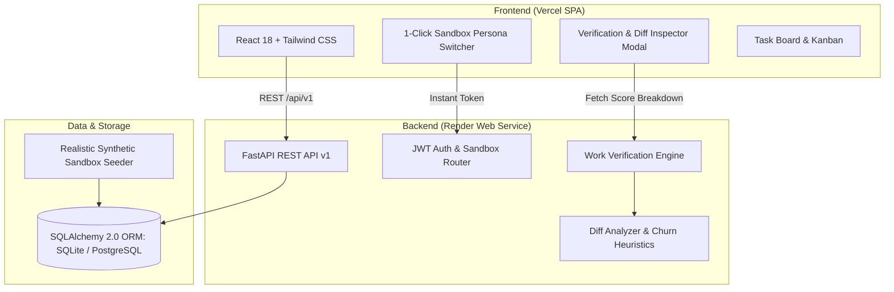

# TaskFlow — Objective Work Verification & Task Intelligence

[](https://github.com/Sparsh566/Taskflow/actions)


> **"Task tools track status, not whether work actually happened."**

---

## ⚡ The Problem

Modern project management tools (Jira, Linear, Asana, Trello) are built around **proxy metrics**: moving a card from *In Progress* to *Done*, logging 8 hours on a timesheet, or closing a ticket. None of them verify whether actual, meaningful work occurred.

- A developer can reformat imports, push 2 lines of comments, or touch whitespace across 10 files to inflate commit counts.
- A non-technical deliverable can be marked complete without attaching the required brief, checklist, or executive slide deck.
- Managers are forced to either spend hours manually diffing pull requests and cross-checking spreadsheets, or accept reported task status on blind faith.

**TaskFlow** bridges daily task management with **automated, objective work verification**. It inspects actual technical artifacts (git diffs, functional code lines, commit message substance) and non-technical deliverables (acceptance criteria, checklist compliance, documents) to score and verify work before sign-off.

---

## 🎯 1-Click Interactive Live Demo (No Credentials Needed)

The live deployment features an **embedded 1-click persona switcher** and an **isolated sandbox environment**. You do not need to copy and paste passwords or connect real private repositories.

| Persona Button | Role | Capabilities in Sandbox |
|---|---|---|
| **👔 Try as Manager** | *Sarah Chen (Tech Lead)* | Audits code diffs, views "Why This Score" breakdowns, triggers live commit simulations, approves or rejects tasks |
| **💻 Try as Employee** | *Alex Rivera (Senior Dev)* | Inspects linked git branch, satisfies acceptance criteria checklists, views score feedback and improvement tips |
| **🛡️ Try as Admin** | *System Admin* | Manages organizational departments, configures custom workspaces, inspects system telemetry |

> **Sandbox Trust Guarantee:** The live demo operates exclusively on an isolated sandbox database populated with synthetic records. No private repositories, corporate files, or Personal Access Tokens are ever requested or stored.

---

## 🧠 Explainable Heuristic Verification Engine

TaskFlow rejects "black-box" scoring. Every verification result provides an itemized **"Why This Score?"** breakdown that directly answers fairness concerns and audits the exact heuristic factors:

```
Starting Baseline Trust Score:                                +100.0 pts
├── Low-Information Commit Message ('update', 'fix', 'wip'):   -15.0 pts
├── Micro-Change Delta (delta <= 2 lines):                     -10.0 pts
├── Excessive Whitespace Manipulation (>85% whitespace):       -40.0 pts
├── Predominantly Comment Churn (>85% comments):               -25.0 pts
├── Probable Autoformatter Churn (adds == deletes > 50):       -20.0 pts
├── Incomplete Acceptance Criteria (e.g. 50% fulfilled):       -15.0 pts
└── Missing Deliverable Evidence (Docs/Checklist):             -40.0 pts
```

### Fairness & Human-in-the-Loop Override
- **Deterministic Rules:** Scores are calculated from published, objective heuristics—never arbitrary manager sentiment or opaque algorithms.
- **Explainability:** Each score is accompanied by a plain-English explanation, a itemized factor table, and concrete **actionable steps** for the contributor to achieve 100/100.
- **Human Discretion:** The system provides decision support, not unappealable automated punishment. Managers have full override authority to approve or request revisions with structured feedback.

---

## 🖼️ Visual Walkthrough

### 1. Verification Workbench & Telemetry Breakdown
Inspect the calculated significance score, flagged conditions (e.g., whitespace churn, trivial messages), and the itemized "+/- points" breakdown for every task.

```
┌────────────────────────────────────────────────────────────────────────┐
│  Objective Work Verification Heuristics            [ 97.5/100 ]        │
│  Calculated Significance & Evidence Score          EXCELLENT           │
├────────────────────────────────────────────────────────────────────────┤
│  💡 Why this score?                                                    │
│  Task achieved 97.5/100. Verified 84 functional code additions with   │
│  100% acceptance criteria satisfied and clear commit intent.          │
├────────────────────────────────────────────────────────────────────────┤
│  [+] Functional Code Additions (+84 lines across 3 files)              │
│  [+] All Acceptance Criteria Satisfied (4/4 items checked)             │
│  [+] Branch Linked: feat/auth-tokens                                   │
└────────────────────────────────────────────────────────────────────────┘
```

### 2. Live Commit Simulation Engine
Test clean code vs whitespace churn directly inside the modal to observe real-time score recalculation and risk-flagging without touching your local terminal.

---

## 🏛️ System Architecture



---

## 🧪 Verification Engine Test Suite

The heuristic engine is verified by a suite of **21 unit tests** covering edge cases, severe penalty combinations, diff classifications, and deliverable compliance:

```bash
# Run the verification engine test suite
cd backend
.\venv\Scripts\pytest -v tests/test_verification_engine.py
```

### Test Coverage Highlights:
- ✅ **Clean functional commits:** Validates that meaningful code additions achieve 95–100 scores.
- ✅ **Empty commits:** Verifies immediate 90-point deduction and `empty_commit` flag.
- ✅ **Micro changes:** Verifies penalty on 1–2 line modifications.
- ✅ **Trivial commit messages:** Checks pattern matches (`update`, `fix`, `wip`, `test`, `typo`, `.`).
- ✅ **Whitespace churn:** Verifies detection of patches with >85% whitespace manipulation.
- ✅ **Comment churn:** Verifies detection and penalization of non-code docstring churn.
- ✅ **Auto-formatter detection:** Flags symmetric large churn (additions == deletions > 50).
- ✅ **Score clamping:** Asserts scores strictly remain within `[5.0, 100.0]`.
- ✅ **Acceptance criteria fulfillment:** Tests proportional penalties (0%, 25%, 50%, 100%).
- ✅ **Deliverables & checklists:** Tests document and checklist answer verification.
- ✅ **Fairness & explanation guarantees:** Asserts generation of itemized score breakdown and fairness notes.

---

## ☁️ Deployment Architecture & Reviewer Guide

To ensure high reliability and zero downtime, TaskFlow is deployed with a clear separation of concerns:

| Component | Platform | Configuration & Details |
|---|---|---|
| **Frontend** | **Vercel** | React + Vite build deployed as a high-performance SPA. Configured via `frontend/vercel.json` with path rewrites to proxy `/api/*` directly to the backend. |
| **Backend** | **Render** | Python 3.11 FastAPI service managed via `render.yaml`. Runs Uvicorn with auto-restart, healthchecks at `/health`, and CORS configured for cross-origin web/mobile clients. |
| **Database** | **SQLite / PostgreSQL** | SQLAlchemy 2.0 abstraction with automatic connection string normalization (`postgres://` → `postgresql://`). Runs on SQLite for zero-config local dev and sandbox preview, and instantly binds to managed PostgreSQL (Render Postgres, Neon, or Supabase) via `DATABASE_URL`. |

### Reviewer Verification Steps:
1. **Health Check:** Query `https://taskflow-hz2k.onrender.com/health` → returns `{"status":"healthy","service":"TaskFlow","version":"1.0.0"}`.
2. **Interactive Swagger Documentation:** Explore all interactive endpoints at [Swagger UI](https://taskflow-hz2k.onrender.com/docs).
3. **Continuous Integration:** Every commit triggers GitHub Actions (`.github/workflows/ci.yml`) to run the 21 pytest heuristics and build the frontend bundle.

---

## 🔍 Known Limitations

Admitting engineering boundaries is essential for production maturity:

1. **Heuristic Pattern Analysis vs. AST Semantic Execution:** TaskFlow currently analyzes patch diffs, whitespace ratios, and commit metadata. It does not parse full language-specific Abstract Syntax Trees (ASTs) or execute test coverage suites inside isolated Docker containers.
2. **Sandbox Simulator vs. Production Webhooks:** In the public sandbox, commit pushing is simulated in-browser to avoid requiring reviewer GitHub OAuth scopes. Production deployment connects via a GitHub App webhook secret (`/api/v1/github/webhook`).
3. **Deliverable Verification Scope:** Non-technical evidence evaluates document presence, file extensions, and completion checklists. Deeper semantic analysis of PDF slide decks or design tokens is planned for future phases.

---

## 💻 Local Development Setup

### Backend (FastAPI + Python 3.11)
```bash
cd backend
python -m venv venv
# Windows:
.\venv\Scripts\activate
# Linux/macOS:
source venv/bin/activate

pip install -r requirements.txt
python run.py
# Server running at http://localhost:8000 (Docs at /docs)
```

### Frontend (React + Vite)
```bash
cd frontend
npm install
npm run dev
# App running at http://localhost:5173
```

---

## 📄 License
MIT © 2026 TaskFlow Authors.
