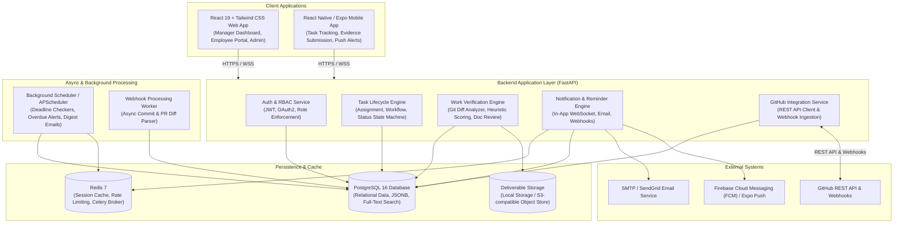
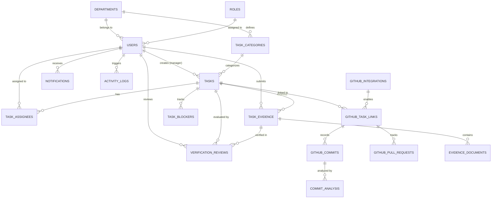
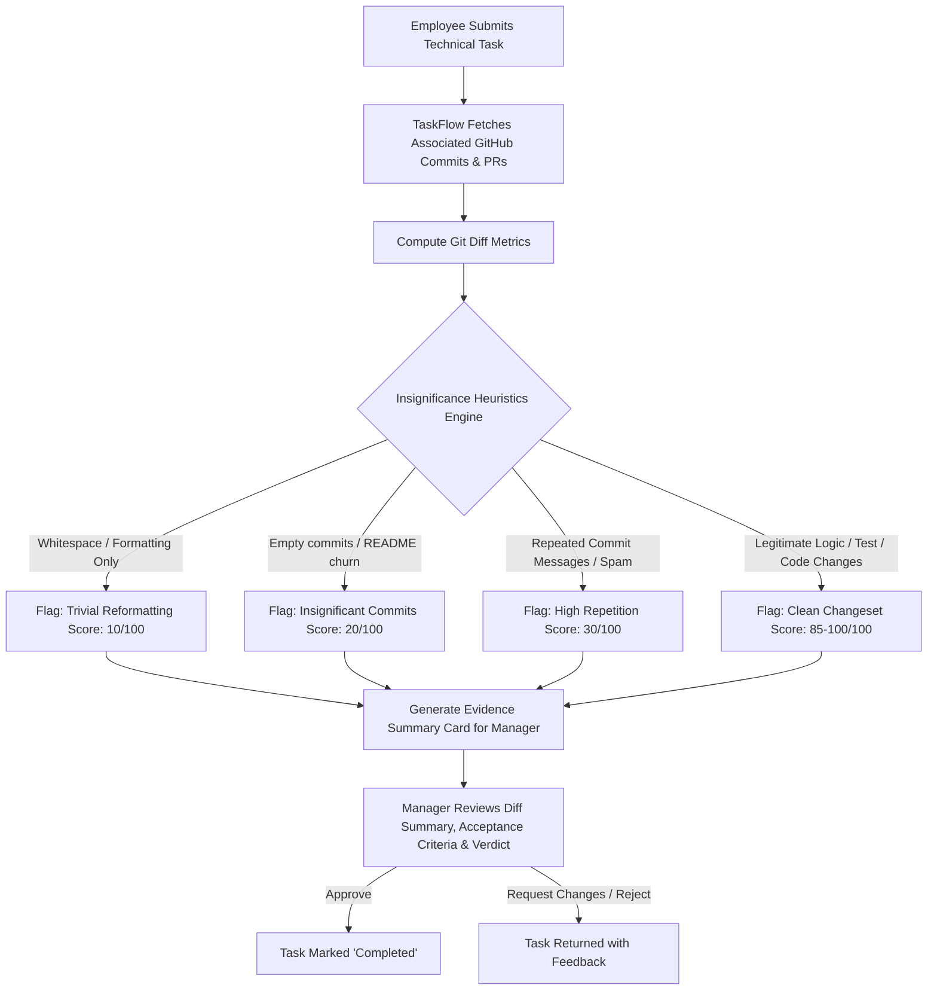
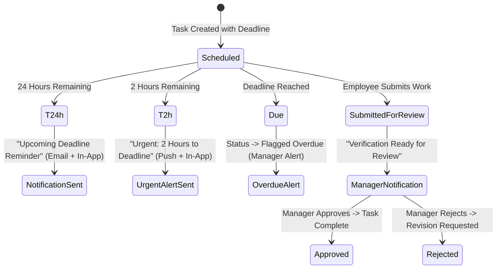

# TaskFlow — System Architecture & Specification Blueprint

Employee Task Management, Work Verification & Mobile Application Platform

---

## 1. Executive Summary & Architecture Overview

**TaskFlow** is an enterprise-grade employee task management platform that bridges task tracking with objective work verification. It supports both technical teams (via GitHub commit, branch, PR, and diff analysis) and non-technical departments (via document uploads, structured checklists, deliverables, and external links).

### 1.1 High-Level Architecture Diagram



---

## 2. Database Schema & Entity-Relationship Model (ERD)

The data model uses PostgreSQL with UUID primary keys, relational foreign keys with referential integrity, indexes on frequently queried foreign keys/statuses, and JSONB fields for flexible metadata (such as commit diff heuristics and dynamic acceptance criteria).

### 2.1 Mermaid Entity-Relationship Diagram (ERD)



### 2.2 Relational Database Schema Specification (PostgreSQL DDL)

#### 1. Core Users, Roles & Departments

```sql
-- Enums
CREATE TYPE user_role_enum AS ENUM ('admin', 'manager', 'employee');
CREATE TYPE department_type_enum AS ENUM ('technical', 'non_technical');
CREATE TYPE task_priority_enum AS ENUM ('low', 'medium', 'high', 'urgent');
CREATE TYPE task_status_enum AS ENUM ('pending', 'in_progress', 'blocked', 'under_review', 'completed', 'rejected');
CREATE TYPE verification_type_enum AS ENUM ('github_code', 'document_deliverable', 'checklist', 'external_link', 'hybrid');
CREATE TYPE verification_status_enum AS ENUM ('unverified', 'flagged_insignificant', 'passed_precheck', 'manager_approved', 'manager_rejected');

-- Departments
CREATE TABLE departments (
    id UUID PRIMARY KEY DEFAULT gen_random_uuid(),
    name VARCHAR(100) NOT NULL UNIQUE,
    code VARCHAR(20) NOT NULL UNIQUE, -- e.g. ENG, AIML, HR, MKT, OPS
    type department_type_enum NOT NULL DEFAULT 'technical',
    description TEXT,
    created_at TIMESTAMPTZ NOT NULL DEFAULT NOW(),
    updated_at TIMESTAMPTZ NOT NULL DEFAULT NOW()
);

-- Users
CREATE TABLE users (
    id UUID PRIMARY KEY DEFAULT gen_random_uuid(),
    department_id UUID REFERENCES departments(id) ON DELETE SET NULL,
    role user_role_enum NOT NULL DEFAULT 'employee',
    email VARCHAR(255) NOT NULL UNIQUE,
    hashed_password VARCHAR(255) NOT NULL,
    full_name VARCHAR(150) NOT NULL,
    avatar_url VARCHAR(500),
    github_username VARCHAR(100),
    is_active BOOLEAN NOT NULL DEFAULT TRUE,
    created_at TIMESTAMPTZ NOT NULL DEFAULT NOW(),
    updated_at TIMESTAMPTZ NOT NULL DEFAULT NOW()
);
CREATE INDEX idx_users_department ON users(department_id);
CREATE INDEX idx_users_role ON users(role);
CREATE INDEX idx_users_github_user ON users(github_username);
```

#### 2. Task Management & Categories

```sql
-- Department-specific Task Categories
CREATE TABLE task_categories (
    id UUID PRIMARY KEY DEFAULT gen_random_uuid(),
    department_id UUID NOT NULL REFERENCES departments(id) ON DELETE CASCADE,
    name VARCHAR(100) NOT NULL,
    default_verification_type verification_type_enum NOT NULL DEFAULT 'document_deliverable',
    description TEXT,
    created_at TIMESTAMPTZ NOT NULL DEFAULT NOW()
);

-- Tasks
CREATE TABLE tasks (
    id UUID PRIMARY KEY DEFAULT gen_random_uuid(),
    category_id UUID REFERENCES task_categories(id) ON DELETE SET NULL,
    creator_id UUID NOT NULL REFERENCES users(id) ON DELETE RESTRICT,
    title VARCHAR(255) NOT NULL,
    description TEXT NOT NULL,
    priority task_priority_enum NOT NULL DEFAULT 'medium',
    status task_status_enum NOT NULL DEFAULT 'pending',
    verification_type verification_type_enum NOT NULL DEFAULT 'document_deliverable',
    acceptance_criteria JSONB NOT NULL DEFAULT '[]'::jsonb, -- Array of criterion strings or checklist items
    deadline TIMESTAMPTZ NOT NULL,
    started_at TIMESTAMPTZ,
    submitted_at TIMESTAMPTZ,
    completed_at TIMESTAMPTZ,
    created_at TIMESTAMPTZ NOT NULL DEFAULT NOW(),
    updated_at TIMESTAMPTZ NOT NULL DEFAULT NOW()
);
CREATE INDEX idx_tasks_creator ON tasks(creator_id);
CREATE INDEX idx_tasks_status ON tasks(status);
CREATE INDEX idx_tasks_deadline ON tasks(deadline);

-- Task Assignees (supports single or multi-assignee)
CREATE TABLE task_assignees (
    id UUID PRIMARY KEY DEFAULT gen_random_uuid(),
    task_id UUID NOT NULL REFERENCES tasks(id) ON DELETE CASCADE,
    user_id UUID NOT NULL REFERENCES users(id) ON DELETE CASCADE,
    assigned_at TIMESTAMPTZ NOT NULL DEFAULT NOW(),
    UNIQUE(task_id, user_id)
);
CREATE INDEX idx_task_assignees_user ON task_assignees(user_id);

-- Task Blockers
CREATE TABLE task_blockers (
    id UUID PRIMARY KEY DEFAULT gen_random_uuid(),
    task_id UUID NOT NULL REFERENCES tasks(id) ON DELETE CASCADE,
    reporter_id UUID NOT NULL REFERENCES users(id) ON DELETE RESTRICT,
    reason TEXT NOT NULL,
    is_resolved BOOLEAN NOT NULL DEFAULT FALSE,
    resolved_at TIMESTAMPTZ,
    resolver_id UUID REFERENCES users(id) ON DELETE SET NULL,
    created_at TIMESTAMPTZ NOT NULL DEFAULT NOW()
);
```

#### 3. GitHub Technical Integration & Evidence

```sql
-- GitHub Repositories Linked to Organization/System
CREATE TABLE github_integrations (
    id UUID PRIMARY KEY DEFAULT gen_random_uuid(),
    repo_name VARCHAR(200) NOT NULL, -- owner/repo
    repo_url VARCHAR(500) NOT NULL,
    access_token_encrypted TEXT,
    webhook_secret VARCHAR(255),
    is_active BOOLEAN NOT NULL DEFAULT TRUE,
    created_at TIMESTAMPTZ NOT NULL DEFAULT NOW()
);

-- Task to GitHub Repository / Branch Association
CREATE TABLE github_task_links (
    id UUID PRIMARY KEY DEFAULT gen_random_uuid(),
    task_id UUID NOT NULL REFERENCES tasks(id) ON DELETE CASCADE,
    integration_id UUID NOT NULL REFERENCES github_integrations(id) ON DELETE CASCADE,
    branch_name VARCHAR(255),
    expected_pr_number INT,
    created_at TIMESTAMPTZ NOT NULL DEFAULT NOW(),
    UNIQUE(task_id, integration_id)
);

-- Captured Commits for Task Verification
CREATE TABLE github_commits (
    id UUID PRIMARY KEY DEFAULT gen_random_uuid(),
    task_link_id UUID NOT NULL REFERENCES github_task_links(id) ON DELETE CASCADE,
    commit_sha VARCHAR(40) NOT NULL UNIQUE,
    commit_message TEXT NOT NULL,
    author_github_login VARCHAR(100),
    commit_timestamp TIMESTAMPTZ NOT NULL,
    additions INT NOT NULL DEFAULT 0,
    deletions INT NOT NULL DEFAULT 0,
    files_changed INT NOT NULL DEFAULT 0,
    raw_diff_summary JSONB,
    created_at TIMESTAMPTZ NOT NULL DEFAULT NOW()
);

-- Pull Requests
CREATE TABLE github_pull_requests (
    id UUID PRIMARY KEY DEFAULT gen_random_uuid(),
    task_link_id UUID NOT NULL REFERENCES github_task_links(id) ON DELETE CASCADE,
    pr_number INT NOT NULL,
    title VARCHAR(255) NOT NULL,
    state VARCHAR(30) NOT NULL, -- open, closed, merged
    pr_url VARCHAR(500) NOT NULL,
    merged_at TIMESTAMPTZ,
    additions INT NOT NULL DEFAULT 0,
    deletions INT NOT NULL DEFAULT 0,
    changed_files INT NOT NULL DEFAULT 0,
    created_at TIMESTAMPTZ NOT NULL DEFAULT NOW()
);

-- Automated Code Verification Analysis (Detecting Insignificant / Spam Changes)
CREATE TABLE commit_analysis (
    id UUID PRIMARY KEY DEFAULT gen_random_uuid(),
    commit_id UUID NOT NULL REFERENCES github_commits(id) ON DELETE CASCADE,
    is_whitespace_only BOOLEAN NOT NULL DEFAULT FALSE,
    is_comment_only BOOLEAN NOT NULL DEFAULT FALSE,
    is_trivial_reformat BOOLEAN NOT NULL DEFAULT FALSE,
    heuristic_significance_score NUMERIC(5,2) NOT NULL DEFAULT 100.00, -- 0-100
    risk_flags JSONB NOT NULL DEFAULT '[]'::jsonb, -- e.g. ["repeated_commit_message", "identical_file_churn"]
    created_at TIMESTAMPTZ NOT NULL DEFAULT NOW()
);
```

#### 4. Non-Technical Evidence & Deliverables

```sql
-- Submitted Task Evidence Bundles
CREATE TABLE task_evidence (
    id UUID PRIMARY KEY DEFAULT gen_random_uuid(),
    task_id UUID NOT NULL REFERENCES tasks(id) ON DELETE CASCADE,
    submitter_id UUID NOT NULL REFERENCES users(id) ON DELETE RESTRICT,
    submission_notes TEXT,
    verification_status verification_status_enum NOT NULL DEFAULT 'unverified',
    created_at TIMESTAMPTZ NOT NULL DEFAULT NOW()
);

-- Uploaded Files, Reports, & URLs
CREATE TABLE evidence_documents (
    id UUID PRIMARY KEY DEFAULT gen_random_uuid(),
    evidence_id UUID NOT NULL REFERENCES task_evidence(id) ON DELETE CASCADE,
    title VARCHAR(255) NOT NULL,
    file_type VARCHAR(50) NOT NULL, -- pdf, docx, xlsx, link, image
    file_url VARCHAR(1000) NOT NULL,
    file_size_bytes BIGINT,
    checklist_answers JSONB, -- Completed acceptance criteria items
    created_at TIMESTAMPTZ NOT NULL DEFAULT NOW()
);
```

#### 5. Verification Reviews, Notifications & Auditing

```sql
-- Manager Verification Reviews
CREATE TABLE verification_reviews (
    id UUID PRIMARY KEY DEFAULT gen_random_uuid(),
    task_id UUID NOT NULL REFERENCES tasks(id) ON DELETE CASCADE,
    evidence_id UUID REFERENCES task_evidence(id) ON DELETE SET NULL,
    reviewer_id UUID NOT NULL REFERENCES users(id) ON DELETE RESTRICT,
    verdict verification_status_enum NOT NULL, -- manager_approved or manager_rejected
    feedback_notes TEXT,
    evaluated_github_metrics JSONB, -- summary of lines, commits, significance score
    reviewed_at TIMESTAMPTZ NOT NULL DEFAULT NOW()
);

-- Notifications & Reminders
CREATE TYPE notification_type_enum AS ENUM (
    'task_assigned', 'task_started', 'blocker_raised', 'deadline_approaching',
    'task_overdue', 'submitted_for_review', 'task_approved', 'task_rejected'
);

CREATE TABLE notifications (
    id UUID PRIMARY KEY DEFAULT gen_random_uuid(),
    user_id UUID NOT NULL REFERENCES users(id) ON DELETE CASCADE,
    task_id UUID REFERENCES tasks(id) ON DELETE CASCADE,
    type notification_type_enum NOT NULL,
    title VARCHAR(255) NOT NULL,
    message TEXT NOT NULL,
    is_read BOOLEAN NOT NULL DEFAULT FALSE,
    read_at TIMESTAMPTZ,
    created_at TIMESTAMPTZ NOT NULL DEFAULT NOW()
);
CREATE INDEX idx_notifications_user_unread ON notifications(user_id, is_read);

-- System Audit & Activity Log
CREATE TABLE activity_logs (
    id UUID PRIMARY KEY DEFAULT gen_random_uuid(),
    user_id UUID REFERENCES users(id) ON DELETE SET NULL,
    action VARCHAR(100) NOT NULL,
    entity_type VARCHAR(50) NOT NULL, -- task, evidence, github, user, department
    entity_id UUID,
    metadata JSONB,
    created_at TIMESTAMPTZ NOT NULL DEFAULT NOW()
);
CREATE INDEX idx_activity_logs_entity ON activity_logs(entity_type, entity_id);
```

---

## 3. Work Verification Engine: Technical & Non-Technical Specifications

### 3.1 Technical Verification Logic (GitHub Integration)



#### Heuristic Scoring Rules:
1. **Whitespace & Comment Filter**: Strips whitespace changes and comment-only edits. If effective line delta is zero, score is penalized.
2. **Commit Squashing & Message Repetition**: Identifies duplicate commit messages (e.g. repeated "update", "fix typo") across short time spans.
3. **PR Context**: Matches PR milestone / issue tags (`Fixes #TaskID` or matching branch name `feature/ENG-123-api-auth`).
4. **Acceptance Criteria Verification**: Checks if criteria require unit tests, documentation, or specific file touched.

### 3.2 Non-Technical Verification Logic (Documents & Deliverables)

For departments like Marketing, HR, and Operations:
1. **Document Uploads**: Mandatory attachment validation (PDF, spreadsheets, presentations, assets).
2. **Checklist Enforcement**: All required acceptance checklist items must be signed off by the employee before submission.
3. **Deliverable Links**: URL format verification with preview metadata (e.g., Google Drive links, Figma designs, published articles, Notion boards).
4. **Peer/Manager Review Flow**: Managers can annotate submissions and provide constructive revision requests.

---

## 4. REST API Endpoint Specifications

FastAPI provides an OpenAPI (Swagger) documented REST API. All authenticated endpoints require `Bearer <JWT_TOKEN>`.

### 4.1 Authentication & User Management
| Method | Endpoint | Access Role | Description |
|---|---|---|---|
| `POST` | `/api/v1/auth/login` | Public | Authenticate user, return JWT access & refresh tokens |
| `POST` | `/api/v1/auth/refresh` | Public | Refresh expired access token |
| `GET` | `/api/v1/auth/me` | Authenticated | Return profile, department, and role of logged-in user |
| `GET` | `/api/v1/users` | Admin, Manager | List users with filtering by department or role |
| `POST` | `/api/v1/users` | Admin | Create user, assign department and role |
| `PUT` | `/api/v1/users/{user_id}` | Admin | Update user information, role, or active status |

### 4.2 Department & Category Management
| Method | Endpoint | Access Role | Description |
|---|---|---|---|
| `GET` | `/api/v1/departments` | Authenticated | List all departments (Engineering, AI/ML, HR, etc.) |
| `POST` | `/api/v1/departments` | Admin | Create new department |
| `GET` | `/api/v1/departments/{id}/categories` | Authenticated | List task categories for a specific department |
| `POST` | `/api/v1/categories` | Admin, Manager | Add a department-specific task category |

### 4.3 Task Management & Workflow
| Method | Endpoint | Access Role | Description |
|---|---|---|---|
| `GET` | `/api/v1/tasks` | Authenticated | List tasks with filters (status, priority, department, assignee, overdue) |
| `POST` | `/api/v1/tasks` | Manager, Admin | Create task with deadline, priority, and acceptance criteria |
| `GET` | `/api/v1/tasks/{id}` | Authenticated | Get task details, assignees, evidence, and activity log |
| `PUT` | `/api/v1/tasks/{id}` | Manager, Admin | Update task attributes, deadline, or criteria |
| `PATCH` | `/api/v1/tasks/{id}/status` | Assignee, Manager | Update status (`in_progress`, `blocked`, `under_review`) |
| `POST` | `/api/v1/tasks/{id}/blocker` | Assignee | Report a blocker with descriptive reasoning |
| `PATCH` | `/api/v1/tasks/{id}/blocker/{blocker_id}/resolve` | Manager, Assignee | Resolve reported blocker |

### 4.4 Work Verification & Submissions
| Method | Endpoint | Access Role | Description |
|---|---|---|---|
| `POST` | `/api/v1/tasks/{id}/submit-evidence` | Assignee | Submit deliverables (files, links, checklist answers) |
| `GET` | `/api/v1/tasks/{id}/verification-summary` | Manager, Admin, Assignee | Retrieve automated technical & document analysis |
| `POST` | `/api/v1/tasks/{id}/review` | Manager, Admin | Review task submission: Approve or Reject with feedback |

### 4.5 GitHub Integration & Webhooks
| Method | Endpoint | Access Role | Description |
|---|---|---|---|
| `POST` | `/api/v1/github/integrations` | Admin | Connect repository via personal access token / GitHub App |
| `POST` | `/api/v1/tasks/{id}/link-repo` | Manager, Assignee | Link task to a specific repo, branch, or PR |
| `POST` | `/api/v1/github/webhook` | GitHub Webhook | Ingest commit pushes, PR openings, and branch events |
| `GET` | `/api/v1/tasks/{id}/github-activity` | Authenticated | View aggregated commits, additions/deletions, and PR state |

### 4.6 Notifications & Manager Analytics
| Method | Endpoint | Access Role | Description |
|---|---|---|---|
| `GET` | `/api/v1/notifications` | Authenticated | Get user's notifications (unread count, recent alerts) |
| `PATCH` | `/api/v1/notifications/{id}/read` | Authenticated | Mark notification as read |
| `PATCH` | `/api/v1/notifications/mark-all-read` | Authenticated | Mark all notifications as read |
| `GET` | `/api/v1/analytics/manager-dashboard` | Manager, Admin | Overview of employee workload, overdue rates, pending approvals |
| `GET` | `/api/v1/analytics/department-breakdown` | Manager, Admin | Task completion velocity & department health metrics |

---

## 5. Role-Based Access Control (RBAC) Matrix

| Feature / Resource | Admin | Manager | Employee |
|---|:---:|:---:|:---:|
| System Configuration & Integrations | Full Access | No Access | No Access |
| Create & Manage Departments | Full Access | View Only | View Only |
| Create / Edit Any User | Full Access | View Assigned | Profile Only |
| Create Tasks & Assign Deadlines | Full Access | Full Access | No Access |
| View Department Task Board | Full Access | Department Scope | Department Scope |
| Start Task & Update Progress | Full Access | Allowed | Assigned Only |
| Report & Resolve Blockers | Full Access | Resolve & Report | Report Own |
| Submit Work Evidence (Git / Docs) | Full Access | Allowed | Assigned Only |
| Approve / Reject Submissions | Full Access | Department Tasks | No Access |
| View Manager Analytics Dashboard | System-wide | Department-wide | Personal Metrics |
| Receive Overdue & Review Alerts | System-wide | Department-wide | Assigned Tasks |

---

## 6. Deadline & Automated Notification Engine



---

## 7. Web & Mobile Compatibility Strategy

- **Web Application**:
  - React 19 + Tailwind CSS + Lucide Icons + TanStack Query (React Query)
  - Responsive multi-device layout (Desktop command center, tablet split views)
  - Rich interactive Kanban & List views, diff viewers, and analytics charts
- **Mobile Application**:
  - React Native / Expo (compatible with iOS & Android)
  - Focus on on-the-go actions: Quick status updates, blocker flags, push alerts, photo/deliverable uploads, and manager review cards
- **Shared API Contract**:
  - Strict OpenAPI 3.1 schema generated directly by FastAPI
  - TypeScript types auto-generated from backend Pydantic models to guarantee full type safety across Web and Mobile

---

## 8. Implementation Milestones (12 Modules)

| Phase | Modules Covered | Deliverables |
|---|---|---|
| **Phase 1: Foundation** | 1, 2, 11 | FastAPI setup, PostgreSQL models, Alembic migrations, JWT Auth & RBAC, Seed data |
| **Phase 2: Task Core** | 3, 4, 10 | Task CRUD, Assignee logic, Status lifecycle, Blockers, Web Kanban & List UI |
| **Phase 3: Verification** | 5, 6, 7 | GitHub Webhooks & REST parser, Diff analyzer, Heuristic insignificance filter, Doc uploads |
| **Phase 4: Notifications & Analytics**| 8, 9 | Deadline scheduler, In-app/Push notification delivery, Manager dashboard analytics |
| **Phase 5: Mobile & Polish** | 10, 12 | React Native/Expo app client, Integration tests, Dockerized container deployment |
